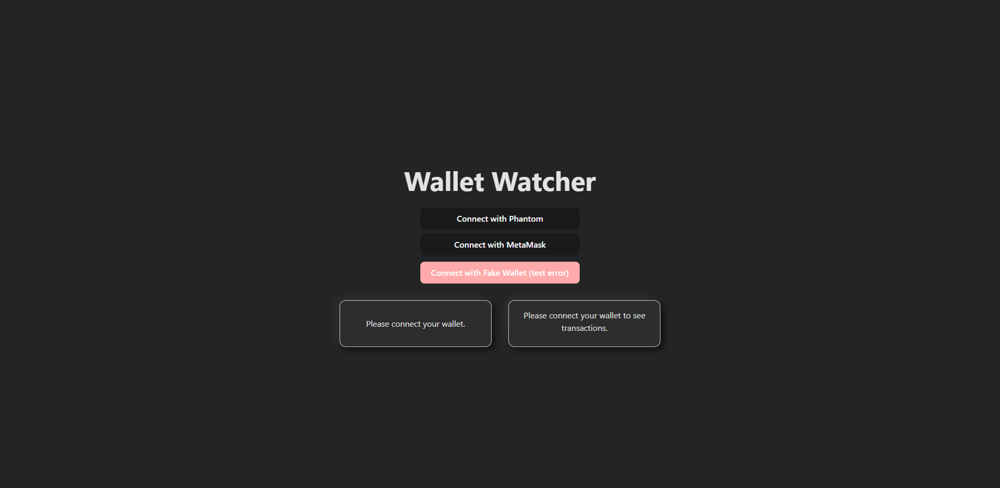
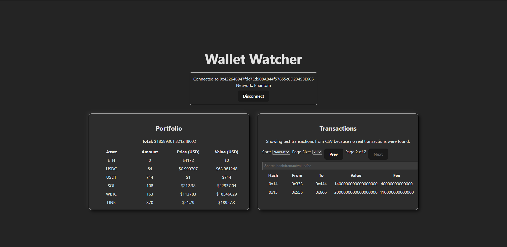
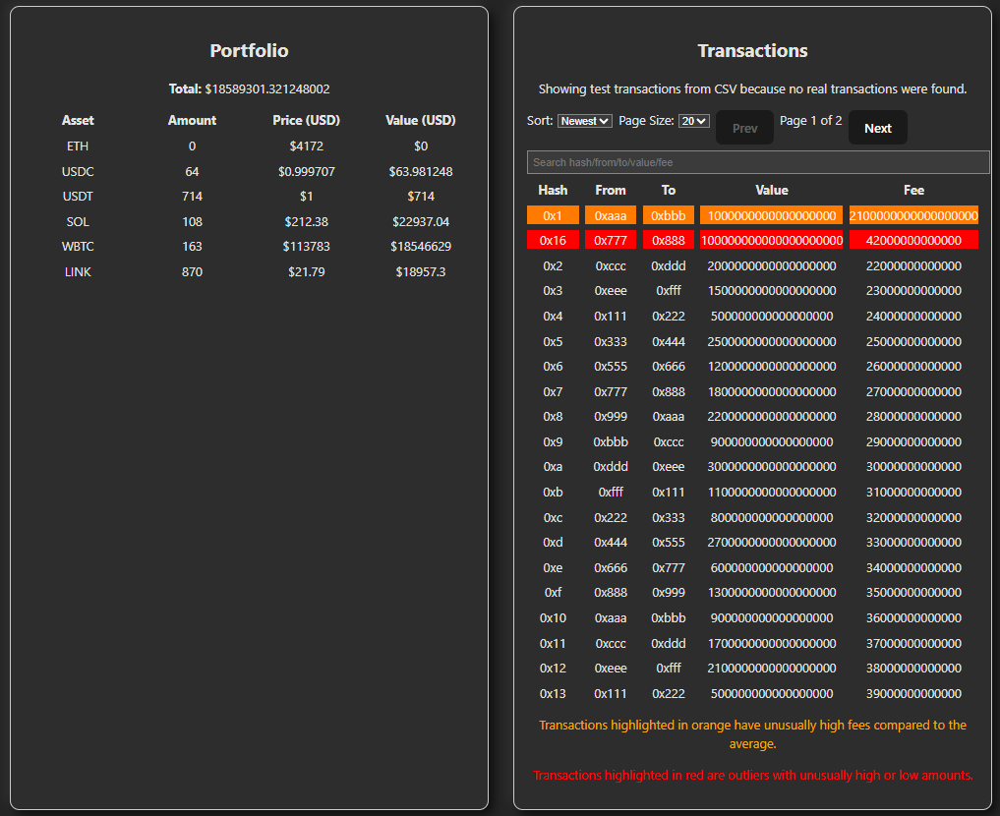

# Wallet Watcher
A lightweight React-based wallet watcher application that allows users to connect their crypto wallets, monitor balances, track transactions, and detect anomalies in real time.

---

## Table of Contents

- [Features](#features)  
- [Tech Stack](#tech-stack)  
- [Setup](#setup)  
- [Architecture & Project Structure](#architecture--project-structure)  
- [Limitations](#limitations)  

---

## Features
- **Wallet Connection**: Connect wallet via a simple button. Displays address, network, and handles connection errors.  
- **Portfolio Dashboard**:  
  - Displays native token balance and 5 predefined ERC-20 token balances.  
  - Shows total portfolio value in USD.  
  - Auto-refreshes every 60 seconds.
- **Transactions Page**:  
  - Displays the last 20–50 transactions.  
  - Sortable by date.  
  - Highlights anomalies, such as high fees or outlier amounts.  

---

## Tech Stack

- **Frontend**: React 18+, TypeScript, Vite  
- **State Management**: React Query  
- **Blockchain Integration**: wagmi + viem  
- **Token Prices**: Coingecko public API with adapter, Etherscan API
- **Linting & Formatting**: ESLint + Prettier  
- **Testing**: some unit tests  

---

## Setup

1. **Clone the repository**  
```bash
git clone <repository-url>
cd wallet-watcher
```

2. **Install dependencies**
```bash
npm install
```

3. **Run the development server**
```bash
npm run dev
```

4. **Run linting**
```bash
npm run lint
```

5. Run tests
```bash
npm run test
```

## Architecture & Project Structure
The project follows a feature-based modular architecture to improve scalability and maintainability.

### Design Decisions:
- **React Query**: For caching, polling, and managing blockchain API requests efficiently.
- **Wagmi + Viem**: Simplifies wallet connection and blockchain data fetching.
- **Coingecko API Adapter, Etherscan API**: Abstracts token price fetching for flexibility.
- **Anomaly Highlighting**: Simple logic to flag transactions with unusually high fees or amounts.


## Limitations
- Only supports 5 predefined ERC-20 tokens.
- Portfolio refresh is fixed - 60 seconds.
